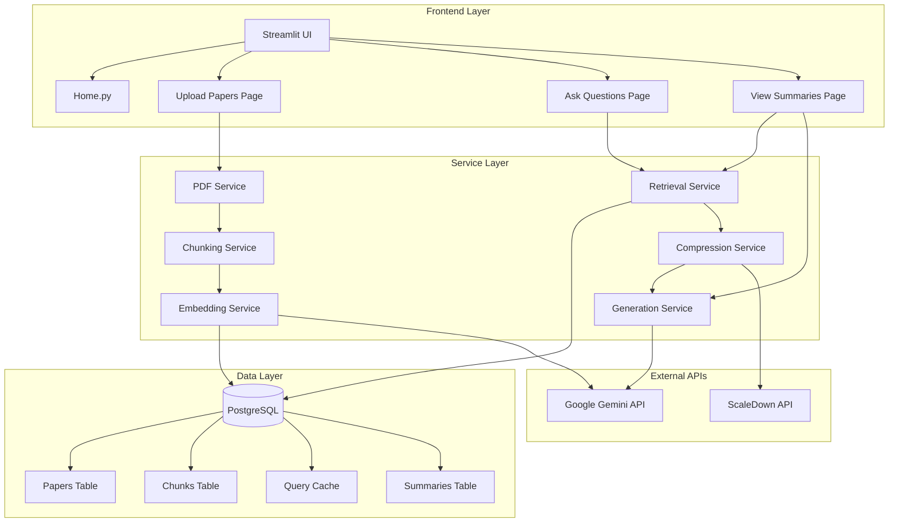
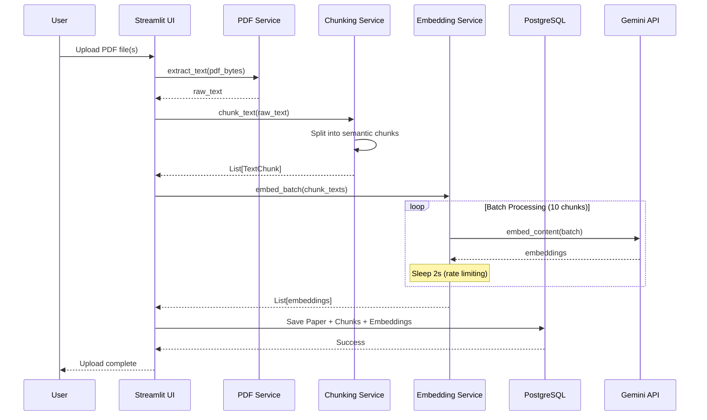
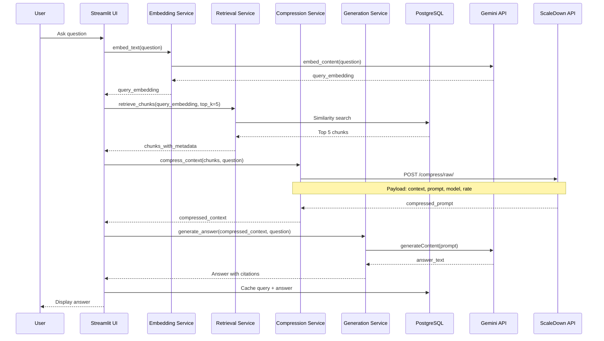

# 🏗️ RAG Academic Paper Summarizer - Architectural Walkthrough

This document provides a deep dive into the system architecture, design patterns, and technical implementation of the RAG Academic Paper Summarizer.

---

## 📐 System Architecture Overview



---

## 🔄 Data Flow Diagrams

### 1. PDF Upload & Indexing Flow



### 2. Question Answering Flow



---

## 🧩 Component Architecture

### Database Models

```python
# Paper Model
class Paper:
    id: int (PK)
    title: str
    filename: str
    file_hash: str (unique)
    upload_date: datetime
    chunks: Relationship[Chunk]
    summaries: Relationship[Summary]

# Chunk Model  
class Chunk:
    id: int (PK)
    paper_id: int (FK → Paper)
    content: str
    chunk_index: int
    token_count: int
    embedding: list[float] (768-dim vector)
    paper: Relationship[Paper]

# Summary Model
class Summary:
    id: int (PK)
    paper_id: int (FK → Paper)
    summary_type: str (abstract|structured|key_points)
    content: str
    created_at: datetime
    paper: Relationship[Paper]

# QueryCache Model
class QueryCache:
    id: int (PK)
    query_text: str
    query_embedding: list[float]
    answer: str
    sources: str (JSON)
    created_at: datetime
```

### Service Layer Design

#### PDF Service
```python
class PDFService:
    def extract_text(pdf_bytes: bytes) -> str:
        """Extract text from PDF using PyMuPDF"""
        # High-fidelity text extraction
        # Preserves formatting and structure
        # Handles multi-column layouts
```

#### Chunking Service
```python
class ChunkingService:
    chunk_size: int = 500  # tokens
    overlap: int = 50      # tokens
    
    def chunk_text(text: str) -> list[TextChunk]:
        """Semantic chunking with overlap"""
        # Uses tiktoken for accurate token counting
        # Preserves paragraph boundaries
        # Maintains context with overlap
```

#### Embedding Service
```python
class EmbeddingService:
    model: str = "gemini-embedding-1.0"
    batch_size: int = 10
    
    def embed_batch(texts: list[str]) -> list[list[float]]:
        """Batch embedding with rate limiting"""
        # Processes in batches of 10
        # 2-second delay between batches
        # Fallback to sequential on errors
        # Returns 768-dimensional vectors
```

#### Retrieval Service
```python
class RetrievalService:
    def retrieve_chunks(
        query_embedding: list[float],
        top_k: int = 5
    ) -> list[ChunkWithMetadata]:
        """Cosine similarity search"""
        # Searches across all papers
        # Returns chunks with source metadata
        # Sorted by relevance score
```

#### Compression Service
```python
class CompressionService:
    api_url: str = "https://api.scaledown.xyz/compress/raw/"
    
    def compress_context(
        context: str,
        query: str
    ) -> str:
        """ScaleDown API integration"""
        # Payload: context, prompt, model, rate
        # Handles dict/list response formats
        # Fallback to uncompressed on errors
        # Logs compression ratios
```

#### Generation Service
```python
class GenerationService:
    model: str = "gemini-1.5-flash"
    
    def generate_answer(
        context: str,
        question: str
    ) -> Answer:
        """RAG-based answer generation"""
        # Temperature: 0.4 (balanced)
        # Includes source citations
        # Confidence assessment
        
    def generate_summary(
        text: str,
        summary_type: str
    ) -> str:
        """Paper summarization"""
        # Temperature: 0.3 (factual)
        # Type: abstract|structured|key_points
        # Caches results
```

---

## 🎨 Frontend Architecture

### Streamlit Page Structure

```
app/
├── Home.py                    # Main entry point
│   ├── Hero header
│   ├── Statistics cards
│   ├── Feature navigation
│   └── Pipeline overview
│
└── pages/
    ├── 1_📄_Upload_Papers.py
    │   ├── Multi-file uploader
    │   ├── Processing progress
    │   ├── Paper library view
    │   └── Delete functionality
    │
    ├── 2_❓_Ask_Questions.py
    │   ├── Chat interface
    │   ├── Query input
    │   ├── Answer display with citations
    │   └── Chat history
    │
    └── 3_📝_View_Summaries.py
        ├── Paper selector
        ├── Summary type selector
        ├── Generate/view summaries
        └── Export functionality
```

### Design System (styles.py)

```python
# Color Palette
PRIMARY = "#6366f1"      # Indigo
SECONDARY = "#8b5cf6"    # Purple
SUCCESS = "#10b981"      # Green
WARNING = "#f59e0b"      # Amber
DANGER = "#ef4444"       # Red

# Typography
FONT_FAMILY = "Inter, system-ui, sans-serif"
HEADING_WEIGHT = 700
BODY_WEIGHT = 400

# Components
- hero_header()      # Large title with subtitle
- stat_card()        # Metric display
- feature_card()     # Feature description box
- page_header()      # Page title with icon
- inject_css()       # Global styles
```

---

## 🔐 Security & Configuration

### Environment Configuration

```python
# config.py using Pydantic
class Settings(BaseSettings):
    gemini_api_key: str
    scaledown_api_key: str
    database_url: str
    gemini_embedding_model: str = "gemini-embedding-1.0"
    gemini_generation_model: str = "gemini-1.5-flash"
    embedding_dimensions: int = 768
    
    class Config:
        env_file = ".env"
        case_sensitive = False
```

### Database Connection Management

```python
# database.py
def get_db_session():
    """Context manager for database sessions"""
    session = SessionLocal()
    try:
        yield session
        session.commit()
    except Exception:
        session.rollback()
        raise
    finally:
        session.close()
```

---

## ⚡ Performance Optimizations

### 1. Batch Embedding
- **Problem**: 100 requests/minute rate limit
- **Solution**: Process 10 chunks per batch with 2s delays
- **Result**: Can handle 300 chunks/minute safely

### 2. Context Compression
- **Problem**: Large contexts exceed token limits
- **Solution**: ScaleDown API reduces context by 40-60%
- **Result**: Lower costs, faster responses

### 3. Summary Caching
- **Problem**: Regenerating summaries is expensive
- **Solution**: Store in database, check before generating
- **Result**: Instant retrieval for cached summaries

### 4. Query Caching
- **Problem**: Repeated questions waste API calls
- **Solution**: Cache query embeddings and answers
- **Result**: Instant answers for duplicate questions

---

## 🧪 Error Handling Strategy

### Layered Error Handling

```python
# Service Layer
try:
    result = external_api_call()
except HTTPStatusError as e:
    logger.error(f"API error: {e.response.text}")
    # Fallback logic
except Exception as e:
    logger.error(f"Unexpected error: {e}")
    raise

# UI Layer
try:
    service_method()
    st.success("Operation completed")
except Exception as e:
    st.error(f"Error: {str(e)}")
    logger.exception("UI operation failed")
```

### Graceful Degradation

1. **Compression fails** → Use uncompressed context
2. **Batch embedding fails** → Fall back to sequential
3. **Database error** → Display user-friendly message
4. **API rate limit** → Implement exponential backoff

---

## 📊 Monitoring & Logging

### Logging Strategy

```python
# Structured logging throughout
logger.info(f"Processing PDF: {filename}")
logger.warning(f"Compression failed, using fallback")
logger.error(f"Database error: {error_details}")

# Key metrics logged:
- PDF processing time
- Chunk count per paper
- Embedding batch sizes
- Compression ratios
- API response times
```

---

## 🚀 Deployment Considerations

### Production Checklist

- [ ] Set up PostgreSQL with proper indexing
- [ ] Configure environment variables securely
- [ ] Set up API key rotation
- [ ] Implement request rate limiting
- [ ] Add monitoring/alerting
- [ ] Set up backup strategy
- [ ] Configure HTTPS
- [ ] Optimize database queries
- [ ] Add user authentication (if multi-user)
- [ ] Set up CI/CD pipeline

### Scaling Strategy

**Vertical Scaling**:
- Increase database resources
- Optimize vector search with indexing
- Cache frequently accessed data

**Horizontal Scaling**:
- Separate API server from database
- Use Redis for caching layer
- Implement job queue for uploads
- Consider vector database (Pinecone/Weaviate)

---

## 🎯 Design Patterns Used

### 1. Repository Pattern
- Database access abstracted through SQLAlchemy models
- Service layer doesn't directly interact with database

### 2. Service Layer Pattern
- Business logic separated from UI
- Reusable services across different pages

### 3. Dependency Injection
- Services receive dependencies via constructor
- Easy to mock for testing

### 4. Factory Pattern
- `get_db_session()` creates database sessions
- `get_settings()` creates configuration objects

### 5. Strategy Pattern
- Different summary types use different generation strategies
- Compression can be enabled/disabled

---

## 📚 Key Technical Decisions

### Why PostgreSQL?
- Native support for array types (embeddings)
- ACID compliance for data integrity
- Mature ecosystem and tooling
- Can scale with proper indexing

### Why Gemini 1.5 Flash?
- Fast response times
- Good quality/cost ratio
- Native embedding model
- Long context window (1M tokens)

### Why ScaleDown?
- Intelligent compression preserves semantics
- Reduces API costs significantly
- Simple REST API integration
- Automatic optimization

### Why Streamlit?
- Rapid prototyping
- Built-in components
- Easy deployment
- Python-native (no JS required)

---

## 🔄 Future Architecture Evolution

### Phase 1: Current (MVP)
- Single-user application
- Local PostgreSQL
- Synchronous processing

### Phase 2: Multi-User
- Add authentication (OAuth)
- User-specific paper libraries
- Role-based access control

### Phase 3: Scale
- Migrate to vector database
- Async job processing (Celery)
- Redis caching layer
- Load balancing

### Phase 4: Advanced Features
- Real-time collaboration
- Knowledge graph visualization
- Advanced analytics
- API for external integrations

---

This architecture provides a solid foundation for academic research workflows while maintaining flexibility for future enhancements.
